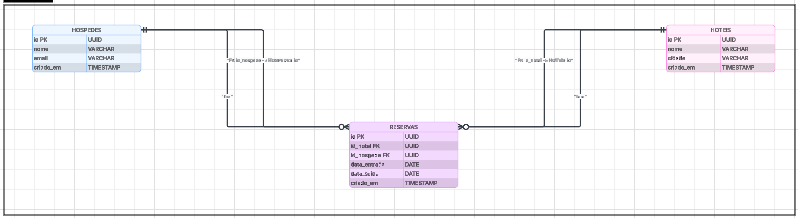

# Modelagem de Dados

A aplicação utiliza **PostgreSQL** como banco de dados relacional para gerenciar hotéis, hóspedes e reservas.

O diagrama abaixo representa a estrutura das tabelas e seus relacionamentos.

## Diagrama do Banco de Dados

---

# Entidades

## Hotéis

Tabela responsável por armazenar informações sobre os hotéis cadastrados no sistema.

| Campo     | Tipo      | Descrição                           |
| --------- | --------- | ----------------------------------- |
| id        | UUID      | Identificador único do hotel (PK)   |
| nome      | VARCHAR   | Nome do hotel                       |
| cidade    | VARCHAR   | Cidade onde o hotel está localizado |
| criado_em | TIMESTAMP | Data de criação do registro         |

---

## Hóspedes

Tabela responsável por armazenar os hóspedes cadastrados.

| Campo     | Tipo      | Descrição                           |
| --------- | --------- | ----------------------------------- |
| id        | UUID      | Identificador único do hóspede (PK) |
| nome      | VARCHAR   | Nome do hóspede                     |
| email     | VARCHAR   | Email do hóspede                    |
| criado_em | TIMESTAMP | Data de criação do registro         |

---

## Reservas

Tabela responsável por registrar as reservas realizadas pelos hóspedes nos hotéis.

| Campo        | Tipo      | Descrição                                   |
| ------------ | --------- | ------------------------------------------- |
| id           | UUID      | Identificador único da reserva (PK)         |
| hotel_id     | UUID      | Identificador do hotel (FK → Hotéis.id)     |
| hospede_id   | UUID      | Identificador do hóspede (FK → Hóspedes.id) |
| data_entrada | DATE      | Data de check-in                            |
| data_saida   | DATE      | Data de check-out                           |
| criado_em    | TIMESTAMP | Data de criação da reserva                  |

---

# Relacionamentos

A modelagem segue as seguintes regras:

* Um **Hotel** pode possuir **várias reservas**
* Um **Hóspede** pode possuir **várias reservas**
* Cada **Reserva** pertence a **um hotel**
* Cada **Reserva** pertence a **um hóspede**

Representação:

Hotéis (1) ────< Reservas >──── (1) Hóspedes

---

# Infraestrutura

O banco de dados é executado em um container **Docker** utilizando **Docker Compose**, garantindo um ambiente consistente e facilmente reproduzível para desenvolvimento.

O container sobe automaticamente com o serviço **PostgreSQL**, permitindo que o backend se conecte ao banco sem necessidade de instalação manual.
